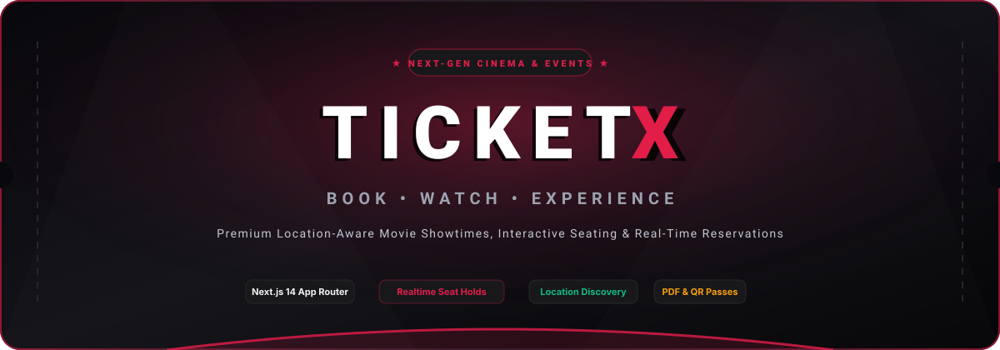
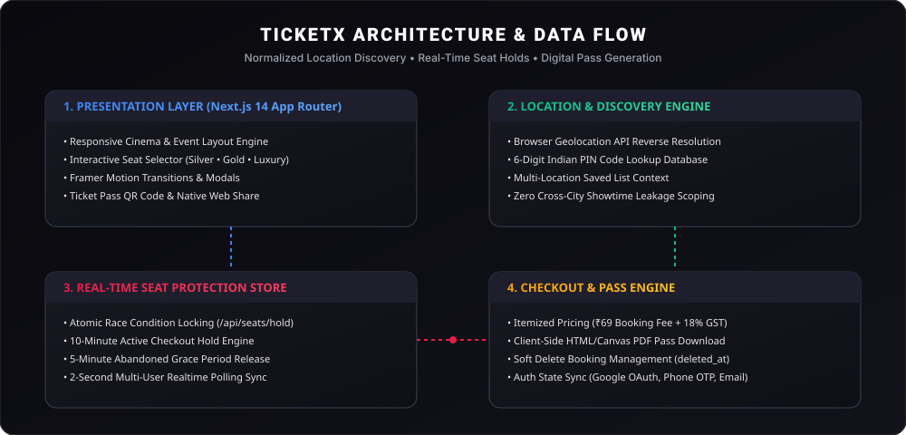

<div align="center">

  

  <br /><br />

  # 🎟️ TicketX

  ### *Cinema Starts Before The Screen.*

  **A modern, location-aware, realtime movie and event ticket booking platform built with Next.js 14, TypeScript, Tailwind CSS, and Framer Motion.**

  <br />

  <p align="center">
    <a href="#-overview">Overview</a> •
    <a href="#-key-features">Features</a> •
    <a href="#-interactive-seating-system">Seating Engine</a> •
    <a href="#-supported-locations">Locations</a> •
    <a href="#-architecture">Architecture</a> •
    <a href="#-tech-stack">Tech Stack</a> •
    <a href="#-getting-started">Setup</a> •
    <a href="#-deployment">Deployment</a>
  </p>

  <br />

  <p align="center">
    
    
    
    
    
    
  </p>

</div>

<br />


<br />

## 🌟 Overview

**TicketX** is a high-performance web platform designed to recreate the sleek, dark, cinematic atmosphere of premium movie premiere booking. Engineered around real-world theater workflows, TicketX provides location-based movie and showtime discovery, interactive seat selection maps, multi-user reservation hold engines, itemized checkout pricing, and digital pass generation with native sharing.

Whether reserving seats for the latest mass Telugu blockbuster (*Debba Debba*) or booking balcony passes for live college festivals (*NEC Freshers*), TicketX delivers a responsive, zero-friction booking experience.

<br />

---

## ⚡ Key Features

<table width="100%">
  <tr>
    <td width="50%" valign="top">
      <h4>🎬 Movie &amp; Show Discovery</h4>
      <ul>
        <li><strong>Location Scoped:</strong> Shows only cinemas active in your chosen city without cross-city data leakage.</li>
        <li><strong>Rich Posters &amp; Backdrops:</strong> Local poster fallback management with video trailer integration.</li>
        <li><strong>New Movie Debut:</strong> Features <em>Debba Debba</em> with prototype city-specific pricing across Guntur, Vijayawada, and Narasaraopeta.</li>
      </ul>
    </td>
    <td width="50%" valign="top">
      <h4>🔒 Multi-User Seat Protection Engine</h4>
      <ul>
        <li><strong>Atomic Seat Holds:</strong> Locks seats during active checkout to prevent double-booking collisions.</li>
        <li><strong>10-Min Active Countdown:</strong> Visual reservation timer on checkout.</li>
        <li><strong>5-Min Grace Period:</strong> Automatic seat release upon abandonment.</li>
        <li><strong>2-Second Realtime Polling Sync:</strong> Live background availability updates without page refreshes.</li>
      </ul>
    </td>
  </tr>
  <tr>
    <td width="50%" valign="top">
      <h4>📍 Geolocation &amp; PIN Code Search</h4>
      <ul>
        <li><strong>Browser Geolocation:</strong> One-tap <code>Use My Location</code> detection via HTML5 Geolocation API.</li>
        <li><strong>6-Digit Indian PIN Search:</strong> Resolves PIN codes (e.g. <code>522001</code>, <code>520001</code>, <code>522601</code>) to supported cities.</li>
        <li><strong>Multiple Saved Locations:</strong> Star and manage multiple saved cities with quick switching.</li>
      </ul>
    </td>
    <td width="50%" valign="top">
      <h4>🎟️ Digital Pass &amp; Web Sharing</h4>
      <ul>
        <li><strong>Client-Side PDF Download:</strong> Generates clean, vector PDF passes for offline admission.</li>
        <li><strong>Native Web Share API:</strong> Shares booking details via mobile share sheets or fallback clipboard copying.</li>
        <li><strong>My Bookings Action Bar:</strong> View Pass, Download, Share, Archive, and Soft Delete (<code>status = 'removed'</code>).</li>
      </ul>
    </td>
  </tr>
</table>

<br />

---

## 💺 Interactive Seating System

The TicketX seating engine features a unified visual architecture for all movie auditoriums and event venues:

```text
               THEATRE AUDITORIUM LAYOUT
  ENTRY →
  ═════════════════════════════════════════════════════
  
  PREMIUM CLASS (Rows A - F)  • Silver-Grey Seats (₹99 - ₹120)
  A1 A2 A3 A4          A5 A6 A7          A8 A9 A10
  
  GOLD CLASS (Rows G - N)     • Warm Metallic Gold (₹129 - ₹159)
  G1 G2 G3 G4          G5 G6 G7          G8 G9 G10
  
  ON LAND LUXURY (Rows O - P) • Deep Burgundy Red (₹777 - ₹1,111)
  O1     O2     O3     O4     O5     O6     O7     O8
  
  ═════════════════════════════════════════════════════
                   CURVED CINEMA SCREEN
  ═════════════════════════════════════════════════════
```

### Seating Rules & Design Visuals
- **Selected Seats:** Instantly transform into **TicketX Red** (`#DC2626` / `#E11D48`) with a scale-up pop animation, white border ring, and checkmark.
- **Continuous Alphabetic Row IDs:** Row labels progress smoothly (`A, B... Z, AA, AB...`) without resetting alphabet per category.
- **Auditorium Entry Marker:** Visible `ENTRY →` indicator on the left side of every theatre layout (does not count toward seating capacity).
- **10-Seat Limit Engine:** Maximum 10 seats per booking (`MAX_SEATS_PER_BOOKING = 10`). Attempting an 11th seat triggers a toast warning without clearing active selections.

<br />

---

## 🎤 Event Seating Architecture

For live stage events (*NEC Freshers* & *StarX Live*), seating is arranged in a dedicated 1,000-seat auditorium layout:

```text
  ▲ TOP / BACK OF EVENT HALL ▲

  SILVER SECTION      — 500 Seats (Rows A to T)    • Starting ₹10,000
  GOLD (BALCONY)      — 300 Seats (Rows U to AI)   • Balcony Elevated View
  PREMIUM SECTION     — 200 Seats (Rows AJ to AS)  • Front Stage Proximity

  ═════════════════════════════════════════════════════
                 ★ MAIN EVENT STAGE ★
  ═════════════════════════════════════════════════════
```

<br />

---

## 🏙️ Supported Locations

| City Name | State | Available Service | Prototype Cinemas / Venues |
| :--- | :--- | :--- | :--- |
| **Guntur** | Andhra Pradesh | Movies | Studio 81 Cinemas (KSP Prime Mall), Plateno, Cine Prime |
| **Vijayawada** | Andhra Pradesh | Movies | Capital Cinemas (Trendset Mall), INOX Urvasi, PVR Ripples |
| **Narasaraopeta** | Andhra Pradesh | Movies &amp; Events | Geetha Multiplex (Kasu Central Mall), NEC Freshers Venue |
| **Sattenapalli** | Andhra Pradesh | Movies | Srinivasa Deluxe |
| **Edlapadu** | Andhra Pradesh | Movies | Venkateswara Theatre |
| **Martur** | Andhra Pradesh | Movies | Sri Lakshmi Theatre |
| **Hyderabad** | Telangana | Live Events | StarX Live Auditorium |

<br />

<details>
<summary><b>🎬 View Detailed Guntur &amp; Vijayawada Theatre List</b></summary>

<br />

#### Guntur Cinemas
- **Studio 81 Cinemas** — KSP Prime Mall (*Debba Debba, Irumudi, Vishwanath &amp; Sons*)
- **Plateno Cinemas** — GT Road
- **Pallavi Keerthana Complex** — Collectorate Road
- **Bhaskar Cinemas** — Arundelpet

#### Vijayawada Cinemas
- **Capital Cinemas** — Trendset Mall (*Debba Debba, Insidious, Vishwanath &amp; Sons*)
- **INOX Urvasi** — Eluru Road
- **PVR Ripples** — MG Road
- **Cinepolis** — PVP Square Mall

</details>

<br />

---

## 🏗️ Architecture

The application is structured around clean data relationships and reactive context providers:

<br />

<div align="center">
  
</div>

<br />

### Data Model Hierarchy
```text
Location (City / PIN Code)
 └── Movie / Event
      └── Theatre / Venue
           └── Showtime
                └── Screen Layout
                     └── Seats (Silver / Gold / Luxury)
                          └── Seat Hold Lock (10-Min Expiry)
                               └── Booking Record & PDF Pass
```

<br />

---

## 🛠️ Tech Stack

### Core Framework & UI
- **[Next.js 14](https://nextjs.org/)** — App Router (`/app`), React Server Components, and Next API Routes.
- **[React 18](https://react.dev/)** — Client components, state management, and custom hooks.
- **[TypeScript 5](https://www.typescriptlang.org/)** — Strict type definitions across models, showtimes, and booking states.
- **[Tailwind CSS](https://tailwindcss.com/)** — Custom dark cinematic design tokens, glassmorphism, and responsive utilities.
- **[Framer Motion](https://www.framer.com/motion/)** — Micro-animations, page transitions, modal spring physics, and seat selection feedback.
- **[Lucide React](https://lucide.dev/)** — Cinema iconography and UI glyphs.
- **[QRCode.react](https://github.com/zpao/qrcode.react)** — SVG barcode and QR ticket pass verification.

### Backend & Storage Services
- **Atomic Seat Hold Store (`lib/serverBookingStore.ts`)** — File-backed and in-memory seat reservation manager.
- **Next.js API Routes (`/api/seats/hold`, `/api/seats/status`, `/api/bookings`)** — RESTful endpoints for locking, syncing, and confirming ticket purchases.

<br />

---

## 📁 Directory Structure

```text
ticketx/
├── app/                        # Next.js 14 App Router Pages & API Routes
│   ├── api/                    # RESTful endpoints (seats/hold, status, bookings)
│   ├── booking/[showId]/       # Interactive theatre seat map page
│   ├── checkout/               # 10-minute hold checkout & payment breakdown
│   ├── events/                 # Event list & 1,000-seat event layout pages
│   ├── login/                  # Google OAuth, Phone OTP & Email login
│   ├── movies/                 # Movie catalog & detail views
│   ├── my-bookings/            # Active & archived passes with PDF download/share
│   └── page.tsx                # Cinematic homepage & hero banner
├── components/                 # Reusable UI & Business Logic Components
│   ├── booking/                # TheatreSeatMap, SeatItem, CinemaScreen, BookingBar
│   ├── checkout/               # BookingSummary, DemoPayment
│   ├── events/                 # EventSeatMap, EventCard
│   ├── layout/                 # Navbar, Footer
│   ├── location/               # CitySelectorModal (PIN lookup, Geolocation)
│   └── ticket/                 # TicketCard, TicketModal (PDF & Native Share)
├── context/                    # React Context Providers
│   ├── AuthContext.tsx         # User sessions (Google OAuth, OTP, Email)
│   └── LocationContext.tsx     # City selection, PIN lookup & saved locations
├── data/                       # Prototype Datasets (Movies, Shows, Theatres, Events)
├── lib/                        # Utility Libraries
│   ├── pdfGenerator.ts         # Client-side printable PDF ticket pass exporter
│   ├── ticketShare.ts          # Native Web Share API + Clipboard fallback
│   ├── pincodeData.ts          # Indian 6-digit PIN code lookup dataset
│   ├── seatColors.ts           # Seat category color definitions
│   └── serverBookingStore.ts   # Atomic seat lock & hold expiration engine
├── public/                     # Static Local Assets
│   ├── events/                 # Local event posters (NEC Freshers, StarX Live)
│   └── posters/                # Local movie posters (Debba Debba, Irumudi, etc.)
└── types/                      # TypeScript Interfaces (Movie, Seat, Booking, Show)
```

<br />

---

## 🚀 Getting Started

Follow these steps to run TicketX locally on your machine.

### Prerequisites
- **Node.js**: `v18.17.0` or higher
- **npm**: `v9.0.0` or higher (or `pnpm` / `yarn`)

### 1. Clone the Repository
```bash
git clone https://github.com/Sanjay200812/TicketX.git
cd TicketX
```

### 2. Install Dependencies
```bash
npm install
```

### 3. Configure Environment Variables
Create a `.env.local` file in the root directory:

```env
# Enable local development authentication mode (accepts any 6-digit numeric OTP)
NEXT_PUBLIC_DEV_AUTH_MODE=true

# Enable demo cinema & showtime data mode
TICKETX_USE_DEMO_CINEMA_DATA=true

# Optional: Google OAuth Client ID (if integrating production Google Cloud credentials)
# NEXT_PUBLIC_GOOGLE_CLIENT_ID=your_google_client_id_here
```

### 4. Start Development Server
```bash
npm run dev
```

Open [http://localhost:3000](http://localhost:3000) in your browser to experience TicketX locally.

<br />

---

## 📜 Available Scripts

| Command | Action |
| :--- | :--- |
| `npm run dev` | Starts the Next.js development server at `http://localhost:3000` |
| `npm run build` | Compiles production-optimized build (validates types & pages) |
| `npm start` | Runs the production build server |
| `npm run lint` | Executes Next.js ESLint checks |

<br />

---

## 💰 Pricing & Taxation Rules

TicketX utilizes transparent itemized checkout calculations:

```text
Ticket Subtotal = Sum of selected seat category prices
Booking Fee     = ₹69 per selected ticket
Taxable Amount  = Ticket Subtotal + Booking Fee
GST Tax (18%)   = Taxable Amount × 0.18
Grand Total     = Taxable Amount + GST Tax
```

*Note: Pricing formulas and booking fee configurations are prototype calculation rules designed for development testing.*

<br />

---

## 🛣️ Development Roadmap

- [x] **Location Scoped Shows:** Zero cross-city theatre leakage.
- [x] **Standardized Cinema Seat Map:** Universal seat renderer with `ENTRY →` markers and absolute bottom curved screen.
- [x] **Real-Time Seat Locks:** 10-minute active checkout hold and 5-minute abandoned grace releases.
- [x] **Digital Ticket Exporter:** Printable PDF pass download & native mobile Web Share API.
- [x] **Indian PIN Code Lookup:** 6-digit PIN code search & browser geolocation.
- [x] **New Telugu Blockbuster Debut:** Featured release of *Debba Debba* with prototype show pricing.
- [ ] **Third-Party Payment Gateways:** Razorpay & UPI integration.
- [ ] **Admin Dashboard:** Cinema manager showtime scheduler & real-time box office analytics.
- [ ] **Native Mobile App:** React Native / Expo companion app.

<br />

---

## 🤝 Contributing

Contributions are welcome! If you'd like to improve TicketX, please follow these steps:

1. Fork the Repository.
2. Create a Feature Branch:
   ```bash
   git checkout -b feature/seat-map-enhancement
   ```
3. Commit your changes:
   ```bash
   git commit -m "Add custom seat map zoom controls"
   ```
4. Push to the Branch:
   ```bash
   git push origin feature/seat-map-enhancement
   ```
5. Open a Pull Request.

<br />

---

## ⚠️ Disclaimer

TicketX is a prototype movie and event ticket booking platform built for demonstration, UI showcase, and technical testing. Theatre listings, showtimes, movie posters, and pricing rules may contain manually configured data for demonstration purposes.

<br />

---

<div align="center">

  

  <br /><br />

  <p fill="#9ca3af" font-size="12">
    Crafted with ❤️ for the ultimate cinema experience.
  </p>

  <p align="right">
    <a href="#top">Back to top ↑</a>
  </p>

</div>
